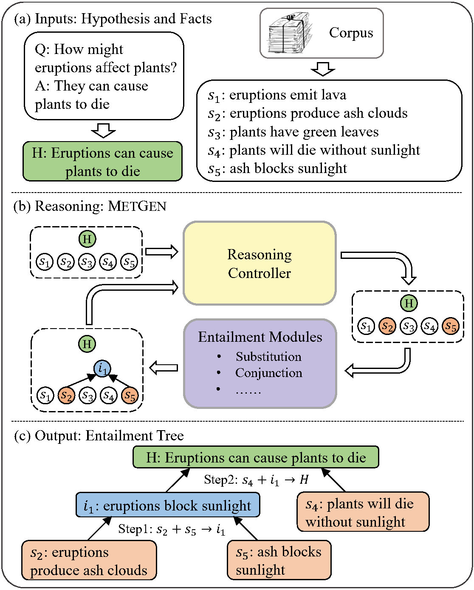
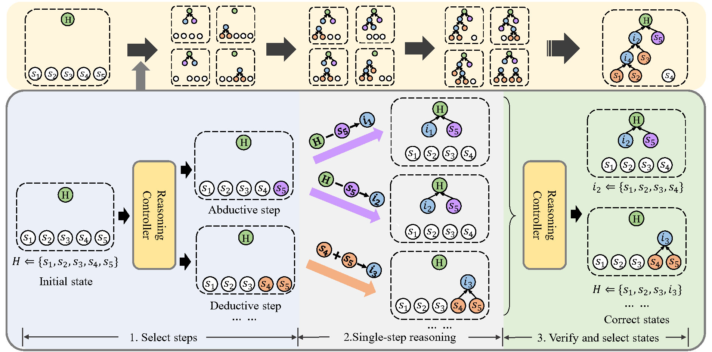

# MetGen

An implementation for [MetGen: A Module-Based Entailment Tree Generation Framework for Answer Explanation](https://arxiv.org/abs/2205.02593).

<p align="center">

</p>

<p align="center">

</p>


# Requirements
- Python 3.8
- Ubuntu 21.04
- Python Packages
```
conda create -n metgen python=3.8
conda activate metgen
pip install -r requirements.txt
```

# Data
Download [EntailmentBank dataset](https://allenai.org/data/entailmentbank).

Download [our processed data](https://cloud.tsinghua.edu.cn/f/15ee068aa4a8495b838e/?dl=1).

The `data/` folder should contain four folders:

```
data
├── entailment_trees_emnlp2021_data_v2  # the EntailmentBank dataset
├── wiki_match                          # the synthetic data for module training
├── Steps                               # the annotated/pseudo step data for module training
└── Controller_data                     # the processed data for controller training
```

# Training

## Single-step entialment module

Follow the `./scripts/train_module.sh` to train the prefixed module.
- Step1: train the module with synthetic data;
- Step2: train the module with Train-pseudo data.

The trained module would be saved in the `/exp/Module_all/para_etree_all` folder.


## Reasoning controller
Follow the `./scripts/train_controller.sh` to train the reasoning controller.

- Step1: make controller training data based on the orginal dataset and the trained module;
- Step2: train the controller with the data.

We train two controllers, one for Task 1 and one for Task 2/3.
The trained controller would be save in the `/exp/Controller_task1` and `/exp/Controller_task2` folders.

# Evaluation

## Inference
Follow the `./scripts/test_task1.sh`, `./scripts/test_task2.sh`, and `./scripts/test_task3.sh` to obtain the predictions based on the trained module and controllers.

- Step1: select the checkpoint and the hyperparameters of reasoning algorithm using the dev split;
- Step2: run the reasoning algorithm with the selected checkpoint and hyperparameters on the test split.

The predictions would be save in `.json` and `.csv` files.

## Automatic Evaluation
Use the `.csv` file and follow the [offical evaluation code of EntailmentBank](https://github.com/allenai/entailment_bank) to evaluate automatically.

For Task 1 and Task 2, we also provide the evaluation metrics by our implementation (`code/evaluate_metric.py`).

# Trained Models

We provide the trained models ([entailment module](https://cloud.tsinghua.edu.cn/f/3608bd001f7a41dca829/?dl=1) and [reasoning controller](https://cloud.tsinghua.edu.cn/f/fd128fdc7e754cb699f9/?dl=1)) for direct reproduction.
Unzip the files and place them in `exp/` folder.
Run the following commands to reproduce the results.
```
cd scripts
sh test_task1.sh
sh test_task2.sh
sh test_task3.sh
```

Please contact [Ruixin Hong](hrx20@mails.tsinghua.edu.cn) for questions and suggestions.


# Citation
```
@inproceedings{hong-2022-metgen,
    title = "{M}et{G}en: {A} Module-Based Entailment Tree Generation Framework for Answer Explanation",
    author = "Hong, Ruixin  and
      Zhang, Hongming  and
      Yu, Xintong  and
      Zhang, Changshui",
      booktitle = "Findings of the 2022 Conference of the North American Chapter of the Association for Computational Linguistics: Human Language Technologies",
      year={2022}
}

```